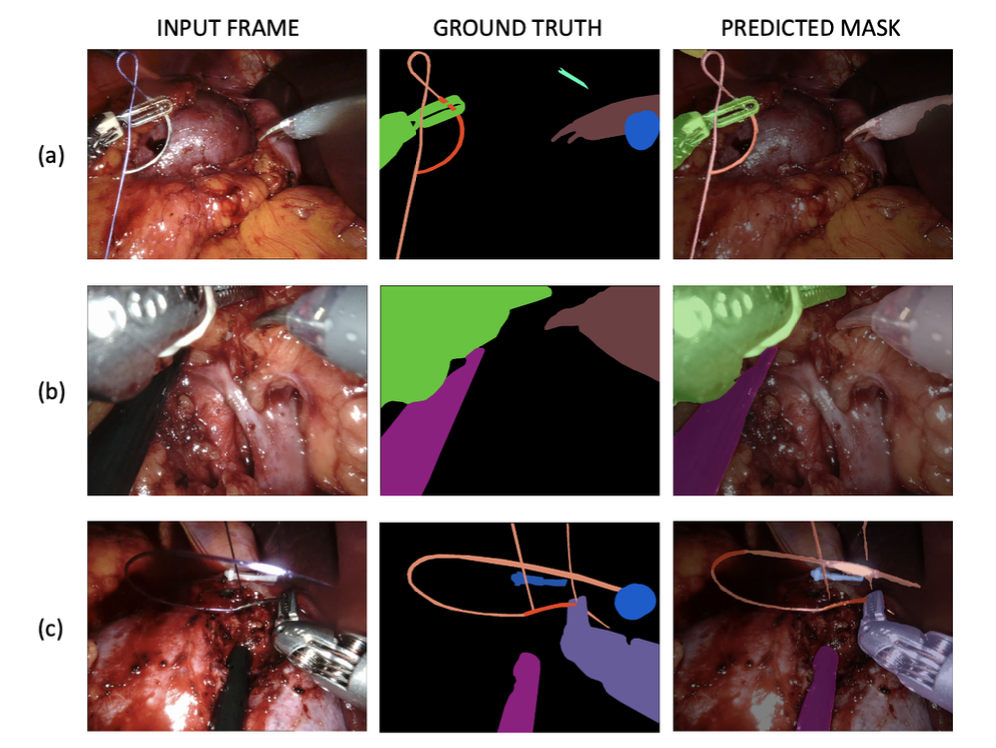

# Surgical Tools and Organs Segmentation in Robot-Assisted Procedures
This repository contains the code I developed for my [Master's thesis](https://scholar.google.com/citations?view_op=view_citation&hl=en&user=iYUVAlIAAAAJ&citation_for_view=iYUVAlIAAAAJ:UeHWp8X0CEIC) during an internship program completed at the [Orsi Academy](https://www.orsi-online.com) (Belgium). The work focuses on developing neural network models for surgical scene segmentation, speifically applied to Robot-Assisted Partial Nephrectomy (RAPN). The first step involved working with a team of doctors and engineers to create the largest dataset of laparoscopic images of partial nephrectomy procedures, complete with annotated masks for surgical tool segmentation (private nowadays). The project covers the numerous steps taken to create this dataset, including the statistical analyses that were carried out. Then, through in-depth analysis of benchmark datasets, the best state-of-the-art neural networks were selected and trained on the created dataset to
obtain good binary and multiclass segmentation models of surgical instruments on our internal dataset.

  

  <em>Some masks predicted by the multiclass model (20 classes) using DeepLabV3+ with EfficientNet-B4.</em>

## Dealing with Temporal Consistency
In a second step, the project also explores how temporal consistency can be leveraged for the segmentation of surgical instruments in videos. For this purpose, we need a dataset with images sampled and annotated at a higher frame rate rather than 1 frame every 10 or 20 seconds. Thus, during the thesis, the datasets were extended to use them to train neural networks with a "temporal part". To annotate these extended datasets we explored a semi-supervised technique called pseudo-labeling.

<figure>
 
 <figcaption><em>Visual explanation of the pseudo-labeling technique, referring to our internal dataset.</em></figcaption>
</figure>

During the project, I explored different strategies to improve the segmentation using temporal information. The final architecture consists in the baseline baseline encoder-decoder with the addition of a Normalized Self-Attention Block in the middle.

<figure>
 
 <figcaption><em>Final segmentation model architecture which takes as input a sequence of frames from a robot-assisted surgery.</em></figcaption>
</figure>

